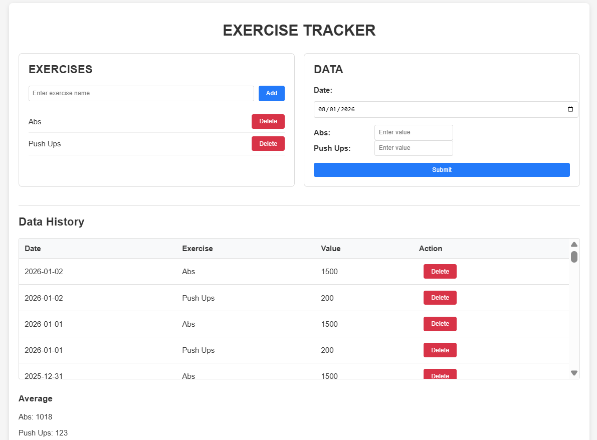
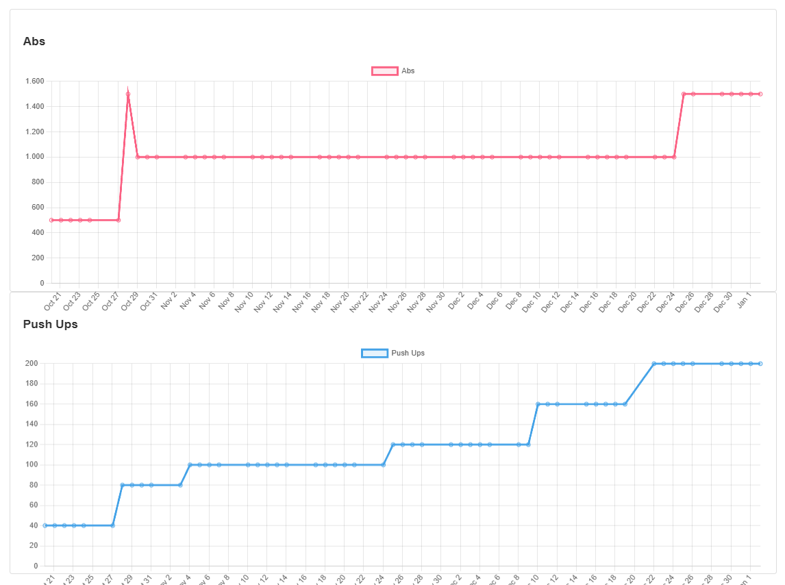

 

# Exercise Tracker

A full-stack web application designed to help users log their workouts, track progress over time, and visualize their performance through interactive charts.

## 📝 Project Overview
This application provides a seamless experience for fitness enthusiasts to manage their routines. Users can define custom exercises, log daily performance data, and view their improvement trends through a dynamic dashboard.

---

## 🚀 Features

### **Front-End (User Interface)**
* **Exercise Management:** Create and delete exercise categories (e.g., Abs, Pull-ups) dynamically.
* **Data Logging:** A user-friendly form with a date picker to record workout values.
* **Dynamic Inputs:** The interface automatically generates input fields based on your active exercise list.
* **Data History:** A comprehensive table displaying all past records with the ability to delete specific entries.
* **Progress Visualization:** Interactive multi-series line charts to track performance trends across different dates.

### **Back-End (Server & Database)**
* **RESTful API:** Robust API endpoints to handle communication between the UI and the database.
* **Data Persistence:** Secure storage of all exercises and workout logs, ensuring data is kept across sessions.
* **CRUD Operations:** Full support for Creating, Reading, and Deleting records for both exercise types and historical logs.
* **Data Integrity:** Validation logic to ensure that workout entries are correctly linked to their respective exercise categories.

---

## 🛠️ Tech Stack

### **Front-end**
* **HTML5 & CSS3:** Structure and professional styling.
* **JavaScript (ES6+):** Application logic and DOM manipulation.
* **Chart.js:** Data visualization via CDN.

### **Back-end**
* **Node.js:** JavaScript runtime environment.
* **Express.js:** Web framework for the API.
* **SQLite3:** Lightweight relational database for data persistence.
* **CORS:** Middleware for cross-origin resource sharing.

---

## 💡 Usage
1.  **Add Exercises:** Add your favorite exercises in the *Exercises* panel.
2.  **Log Data:** Enter your daily results in the *Data* section.
3.  **Review History:** Monitor the *Data History* table for a complete log of your work.
4.  **Analyze Progress:** Check the *Chart* at the bottom to see your physical evolution visually.

---

## ⚙️ Installation (Optional)
If you want to run this project locally:

1. Clone the repo: `git clone <your-repo-url>`
2. Install dependencies: `npm install`
3. Start the server: `node server.js` (or your entry file)
